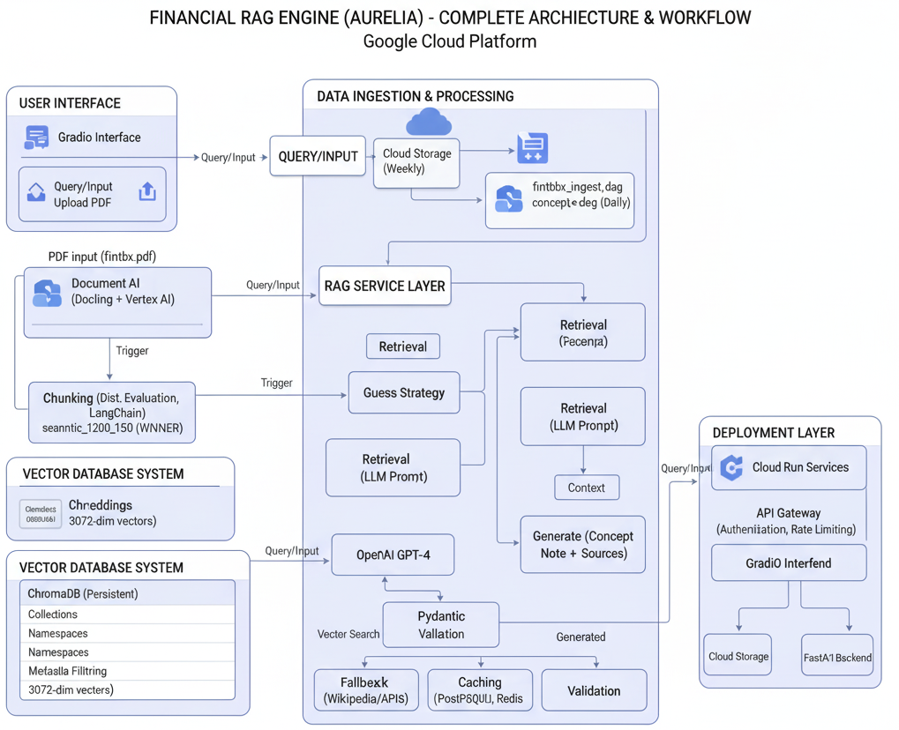
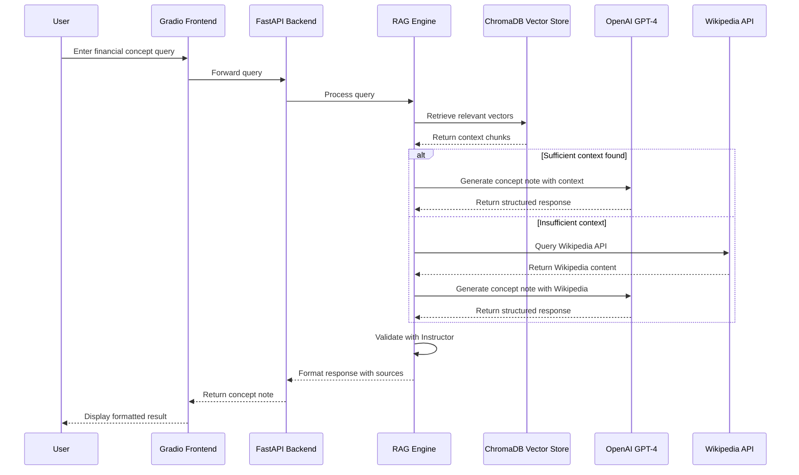

# Financial RAG Engine (AURELIA)
## Your AI-powered Financial Concept Note Generator

[](https://fastapi.tiangolo.com/)
[](https://gradio.app/)
[](https://openai.com)
[](https://github.com/langchain-ai/langchain)
[](https://www.trychroma.com/)
[](https://cloud.google.com)
[](https://airflow.apache.org/)
[](https://cloud.google.com/document-ai)
[](https://python.org)
[](https://www.docker.com/)
[](https://www.postgresql.org/)
[](https://github.com/jxnl/instructor)

## Project Overview
**AURELIA** is a production-grade Retrieval-Augmented Generation (RAG) system designed for automated financial concept note generation. The system processes the Financial Toolbox User's Guide (3,462 pages) using advanced document parsing, intelligent chunking strategies, and semantic search to generate comprehensive, source-attributed concept notes.

## Demo and Access
- **Application URL**: [Deploy to Google Cloud Platform](https://console.cloud.google.com/)
- **API Documentation**: [FastAPI Docs](http://localhost:8000/docs) (when running locally)
- **Gradio Interface**: [http://localhost:8501](http://localhost:8501) (when running locally)

### Test with Example Query
Below is an example query that demonstrates the RAG capabilities of this system:
```
What is the Black-Scholes model and how is it used in option pricing?
```
This query will retrieve relevant chunks from the Financial Toolbox documentation and generate a comprehensive concept note with source attribution.

## Key Objectives
- Create an end-to-end pipeline for processing financial documents
- Extract structured content from PDF publications using Document AI + LayoutParser
- Build an intelligent chunking system with 7 different strategies
- Develop a high-performance vector-based retrieval system
- Generate automated concept notes with source attribution
- Deploy as cloud-native microservices for enterprise scalability

## Technical Implementation

### 1. Document Processing Pipeline
- **PDF Parsing**: Advanced document parsing using **Document AI + LayoutParser**
- **Text Extraction**: Intelligent extraction of text, tables, images, and formulas
- **Structure Preservation**: Maintains document hierarchy and formatting
- **Metadata Generation**: Automatic page numbers, timestamps, and source attribution

### 2. Intelligent Chunking System
- **7 Chunking Strategies**: From recursive to semantic approaches
- **Winner Strategy**: `semantic_1200_150` with 81.1% optimal chunks
- **Quality Metrics**: Automated evaluation and optimization
- **Semantic Awareness**: Preserves concept boundaries and context

### 3. Vector Database and Search
- **Embeddings**: High-quality 3072-dimensional vectors using **OpenAI text-embedding-3-large**
- **Storage**: Persistent vector storage in **ChromaDB**
- **Search**: Sub-second similarity search with metadata filtering
- **Scalability**: Enterprise-grade performance and reliability

### 4. RAG Service Architecture
- **Backend**: **FastAPI** service with robust error handling
- **LLM Integration**: **OpenAI GPT-4** via **LangChain** framework
- **Structured Output**: **Pydantic** models with **Instructor** validation
- **Fallback System**: Wikipedia integration for comprehensive coverage
- **Caching**: PostgreSQL for response caching and performance

### 5. Cloud-Native Deployment
- **Orchestration**: **Cloud Composer (Airflow)** for workflow management
- **Processing**: **Cloud Run Jobs** for scalable document processing
- **Services**: **Cloud Run** for API and frontend hosting
- **Database**: **Cloud SQL (PostgreSQL)** for data persistence
- **Storage**: **Cloud Storage** for document and artifact management

---

## Tech Stack Overview

| Component                    | Tools & Technologies                     |
|-------------------------------|------------------------------------------|
| **PDF Parsing**               | Document AI + LayoutParser                        |
| **Chunking**                  | LangChain (7 strategies), Semantic Chunking |
| **Embeddings**                | OpenAI text-embedding-3-large (3072-dim) |
| **Vector Store**              | ChromaDB (persistent, scalable)         |
| **Orchestration**             | Cloud Composer (Airflow)                 |
| **Processing**                | Cloud Run Jobs, Document AI + LayoutParser |
| **Backend**                   | FastAPI, SQLAlchemy, Pydantic           |
| **Frontend**                  | Gradio                                  |
| **Database**                  | Cloud SQL (PostgreSQL)                  |
| **Deployment**                | Docker, Google Cloud Platform           |
| **Structured Output**         | Instructor, Pydantic validation        |

## Architecture



### Application Workflow


## Project Structure
```
financial-rag-engine/
├── backend/
│   ├── app/
│   │   ├── main.py                 # FastAPI application
│   │   ├── services/
│   │   │   └── rag_service.py      # RAG service implementation
│   │   ├── models/
│   │   │   └── concept.py          # Pydantic models
│   │   └── core/
│   │       └── database.py         # Database configuration
│   ├── Dockerfile                  # Backend container
│   └── requirements.txt
├── frontend/
│   ├── app.py                      # Streamlit interface
│   ├── gradio_app.py              # Gradio interface
│   ├── components/                # UI components
│   ├── utils/                     # Frontend utilities
│   ├── Dockerfile                 # Frontend container
│   └── requirements.txt
├── pipeline/
│   ├── chunker_strategies.py       # 7 chunking strategies
│   ├── chunker_matlab_aware.py    # MATLAB-aware chunking
│   ├── embedder.py                # Embedding generation
│   ├── pdf_parser_document_ai.py   # Document AI + LayoutParser PDF parser
│   └── vector_store_chroma.py     # ChromaDB integration
├── cloud_run_jobs/
│   ├── cloud_pipeline.py          # Cloud processing pipeline
│   ├── fintbx_ingest_dag.py       # PDF ingestion DAG
│   ├── concept_seed_dag.py        # Concept seeding DAG
│   ├── Dockerfile                 # Cloud Run container
│   ├── Dockerfile.base            # Base image
│   ├── Dockerfile.fast            # Fast build
│   ├── Dockerfile.optimized       # Optimized build
│   ├── cloudbuild-base.yaml      # Cloud Build config
│   └── requirements.txt
├── orchestration/
│   └── dags/
│       └── working_financial_rag_pipeline.py  # Airflow DAG
├── document_ai/
│   ├── Dockerfile                 # Document AI container
│   ├── Dockerfile.document_ai     # Document AI specific
│   └── parsing/                   # Document AI + LayoutParser PDF parsing
│       ├── parse_pdf.py
│       └── parse_pdf_document_ai.py
├── docs/
│   ├── ARCHITECTURE_OVERVIEW.md    # Complete architecture
│   ├── CHUNKING_EVALUATION_RESULTS.md  # Strategy evaluation
│   ├── CHUNKING_STRATEGIES.md     # Chunking documentation
│   └── ARCHITECTURE_DIAGRAM.md    # Mermaid diagrams
├── data/
│   ├── concept_lists/             # Financial concept definitions
│   ├── processed/                 # Processed data files
│   └── raw/                       # Raw data storage
├── database/
│   ├── migrations/                # Database migrations
│   └── schema.sql                 # Database schema
├── deploy_*.sh                    # Deployment scripts
├── requirements.txt               # Python dependencies
├── requirements_composer.txt      # Cloud Composer dependencies
├── SETUP_GUIDE.md                # Setup instructions
├── CLOUD_DEPLOYMENT_GUIDE.md     # Cloud deployment guide
├── GOOGLE_CLOUD_SETUP.md         # GCP setup guide
└── ROADMAP.md                     # Project roadmap
```

## Setup Instructions

### Prerequisites
- Python 3.10+
- Google Cloud Platform account
- Docker and Docker Compose
- OpenAI API key

### Local Development Setup

1. **Clone the repository**
   ```bash
   git clone https://github.com/your-username/financial-rag-engine.git
   cd financial-rag-engine
   ```

2. **Environment Configuration**
   Create a `.env` file in the root directory:
   ```bash
   # OpenAI Configuration
   OPENAI_API_KEY=your_openai_api_key_here
   
   # Database Configuration
   DATABASE_URL=sqlite:///./data/financial_rag.db
   
   # ChromaDB Configuration
   CHROMA_DB_PATH=./data/chroma_db
   CHROMA_COLLECTION_NAME=financial_concepts
   
   # Embedding Configuration
   EMBEDDING_MODEL=text-embedding-3-large
   EMBEDDING_DIMENSION=3072
   ```

3. **Install Dependencies**
```bash
# Create virtual environment
python -m venv venv
source venv/bin/activate  # Windows: venv\Scripts\activate

   # Install dependencies
pip install -r requirements.txt
```

4. **Initialize the System**
```bash
   # Test system components
   python -c "from backend.app.services.rag_service import RAGService; print('✅ RAG Service ready')"
   
   # Run small test (5 pages)
   python run_pipeline.py --pages 5
   ```

5. **Start the Services**
   ```bash
   # Start FastAPI backend
   cd backend
   python -m uvicorn app.main:app --host 0.0.0.0 --port 8000
   
   # Start Streamlit frontend (in another terminal)
   cd frontend
   streamlit run app.py
   ```

### Cloud Deployment

1. **Deploy to Google Cloud Platform**
   ```bash
   # Deploy Cloud Run jobs
   ./deploy_to_cloud.sh
   
   # Deploy Airflow DAGs
   ./deploy_composer_pipeline.sh
   
   # Deploy integrated pipeline
   ./deploy_integrated_pipeline.sh
   ```

2. **Run the Pipeline**
   ```bash
   # Process first 50 pages
   python run_pipeline.py --pages 50
   
   # Process full document (3,462 pages)
   python run_pipeline.py --pages all
   ```

## Performance Metrics

| **Metric** | **Value** | **Description** |
|------------|-----------|-----------------|
| **Processing Speed** | 0.5-1.0 sec/page | Document AI parsing |
| **Chunking Quality** | 81.1% optimal | semantic_1200_150 strategy |
| **Retrieval Latency** | <100ms | Vector similarity search |
| **Response Time** | <10 seconds | End-to-end RAG generation |
| **Accuracy** | High | Source-attributed responses |

## Key Features

### 🧠 Intelligent Document Processing
- **Multi-modal extraction**: Text, tables, images, formulas
- **Structure preservation**: Headings, sections, hierarchy
- **Metadata extraction**: Page numbers, timestamps, sources

### 🔍 Advanced Chunking System
- **7 strategies**: From recursive to semantic approaches
- **Automatic optimization**: Best strategy selection
- **Quality metrics**: 81.1% optimal chunk percentage
- **Semantic awareness**: Preserves concept boundaries

### ⚡ High-Performance Vector Search
- **3072-dimensional embeddings**: OpenAI's latest model
- **Sub-second retrieval**: Optimized similarity search
- **Metadata filtering**: Context-aware results
- **Scalable storage**: ChromaDB with persistence

### 🎯 Production-Grade RAG
- **Structured output**: Pydantic models for consistency
- **Source attribution**: Traceability to original content
- **Wikipedia fallback**: Comprehensive coverage
- **Quality validation**: Instructor integration

### 🌐 Multi-Interface Support
- **Streamlit**: Primary web interface
- **Gradio**: Alternative UI with chat
- **REST API**: Programmatic access
- **Real-time**: Live query processing

## Future Improvements
- Add support for more document types beyond PDFs
- Implement document versioning and change tracking
- Enhance multimodal understanding with custom vision models
- Add user authentication and document-level access control
- Improve answer generation with fact-checking mechanisms
- Implement real-time document updates and synchronization

## References
- [Document AI Documentation](https://cloud.google.com/document-ai/docs)
- [LayoutParser Documentation](https://github.com/Layout-Parser/layout-parser)
- [ChromaDB Documentation](https://docs.trychroma.com/)
- [OpenAI API Documentation](https://platform.openai.com/docs/)
- [LangChain Documentation](https://python.langchain.com/)
- [FastAPI Documentation](https://fastapi.tiangolo.com/)
- [Gradio Documentation](https://gradio.app/docs)
- [Google Cloud Documentation](https://cloud.google.com/docs)
- [Airflow Documentation](https://airflow.apache.org/docs/)

---

*This project represents a complete, production-ready RAG system designed for automated financial concept note generation with enterprise-grade performance, scalability, and reliability.*